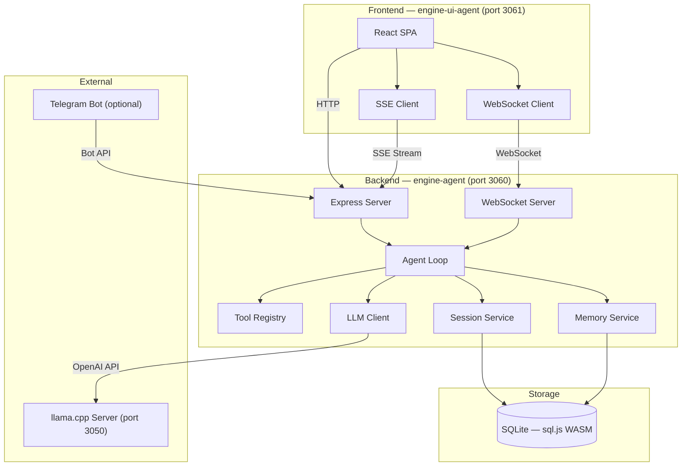
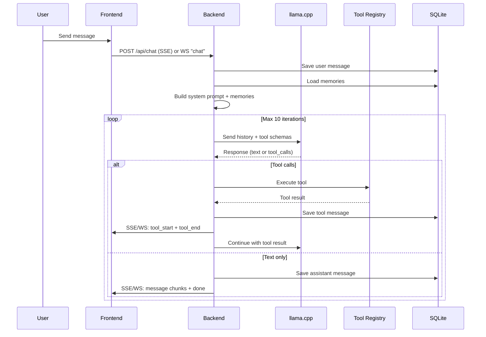
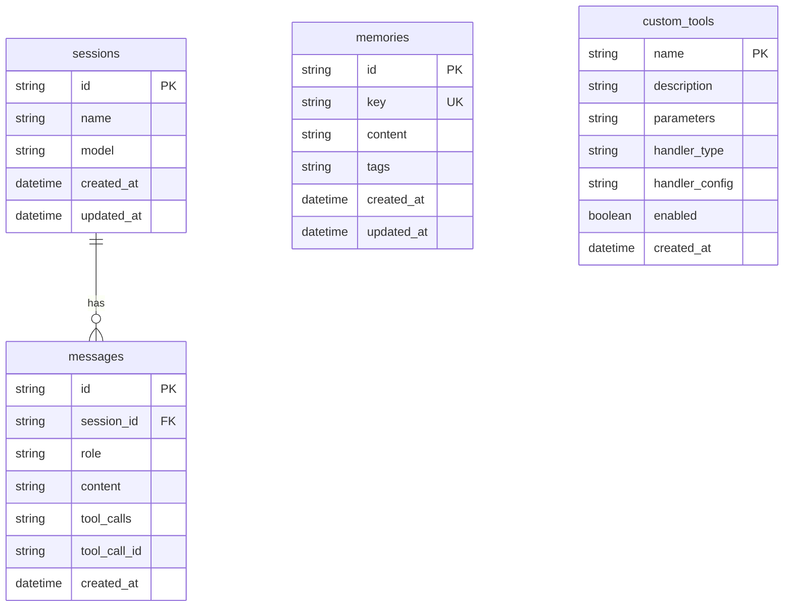
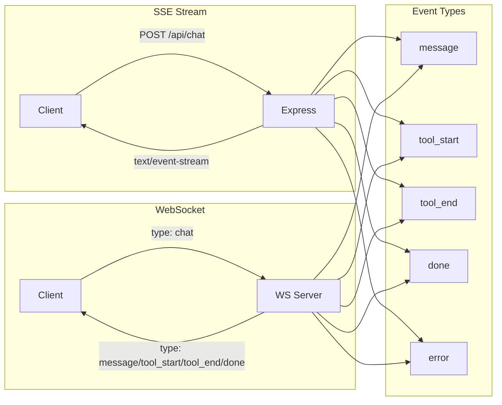

# Architecture — llama-engine-agent

## Diagrama de componentes high-level



---

## Flujo del Agent Loop



---

## Estructura de la base de datos



---

## Flujo de datos — Streaming



---

## Estructura de directorios

```
llama-engine-agent/
├── engine-agent/              # Backend
│   ├── src/
│   │   ├── index.ts           # Entry point + bootstrap
│   │   ├── server.ts          # Express app factory
│   │   ├── ws.ts              # WebSocket server
│   │   ├── config/            # Env validation (Zod)
│   │   ├── db/                # SQLite init + migrations
│   │   ├── agent/             # Agent loop + LLM client + prompt
│   │   ├── tools/             # Registry + 9 built-in tools
│   │   ├── sessions/          # Session CRUD
│   │   ├── memories/          # Memory CRUD
│   │   ├── modules/           # chat, sessions, memories, tools, models, mcp
│   │   ├── middleware/        # auth, validation, errorHandler
│   │   ├── common/            # HTTP exceptions
│   │   └── utils/             # Logger
│   ├── data/                  # SQLite DB
│   └── docs/                  # API-CONTRACTS.md
├── engine-ui-agent/           # Frontend
│   ├── src/
│   │   ├── main.tsx           # Entry point
│   │   ├── App.tsx            # Router + providers
│   │   ├── api.ts             # Types + API functions
│   │   ├── lib/               # fetchClient, WebSocket
│   │   ├── providers/         # ToastProvider, SessionsProvider
│   │   ├── components/        # Layout, Icons
│   │   └── features/
│   │       ├── chat/          # ChatView, Composer, MessageBubble
│   │       └── sessions/      # SessionList
│   └── ...
└── docs/                      # Project documentation
    ├── PRD.md
    ├── ARCHITECTURE.md
    ├── RULES.md
    ├── DESIGN.md
    ├── TASKS.md
    └── MEMORY.md
```

---

## Decisiones técnicas

| Decisión | Elección | Razón |
|----------|----------|-------|
| Runtime backend | Express 4 | Simplicidad, ecosistema amplio |
| Base de datos | SQLite via sql.js (WASM) | Sin dependencias nativas, file-based, suficiente para single-user |
| Validación | Zod | Type inference + validación runtime |
| Linting/Formatting | Biome | Más rápido que ESLint + Prettier, config unificada |
| Frontend framework | React 19 | Latest, concurrent features |
| Bundler | Vite 6 | HMR rápido, ESM nativo |
| State management | React Context + hooks | Sin dependencia externa, suficiente para la complejidad actual |
| Markdown | react-markdown + remark-gfm | GFM support, plugins |
| Testing | Vitest | Compatible con ESM, rápido |
| LLM SDK | openai | Compatible con la API de llama.cpp |
