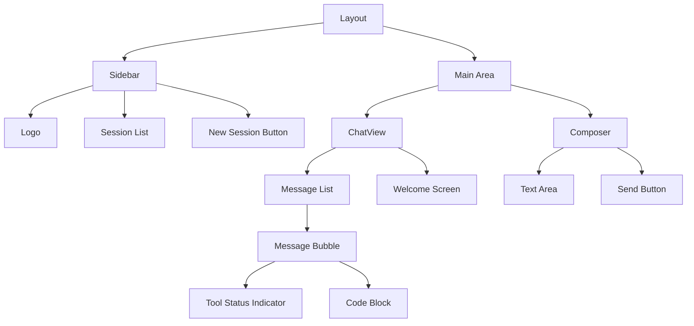
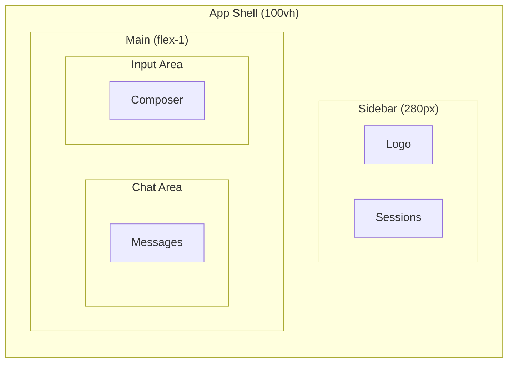
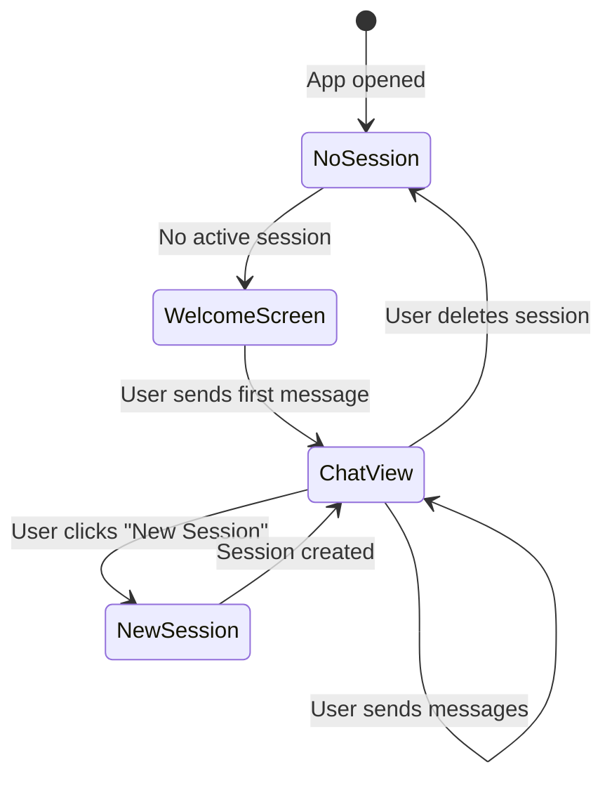

# Design — llama-engine-agent

## Paleta de colores

| Elemento | Valor | Uso |
|----------|-------|-----|
| Background | `#0a0a0f` | Fondo principal |
| Surface | `rgba(255,255,255,0.05)` | Cards, sidebar |
| Surface hover | `rgba(255,255,255,0.08)` | Hover states |
| Border | `rgba(255,255,255,0.1)` | Bordes sutiles |
| Text primary | `#ffffff` | Texto principal |
| Text secondary | `rgba(255,255,255,0.6)` | Texto secundario |
| Accent | `#6366f1` | Indigo — botones primarios, links |
| Success | `#22c55e` | Tool completado, online |
| Warning | `#f59e0b` | Tool ejecutándose |
| Error | `#ef4444` | Errores, toast error |

---

## Efectos visuales

- **Glassmorphism:** Background con blur + transparencia en sidebar y cards.
- **Border glow:** Bordes sutiles con gradiente en focus/hover.
- **Transiciones:** 150ms ease para interacciones.
- **Border radius:** 8px para cards, 6px para inputs, 12px para modals.

---

## Componentes UI

---

## Layout

---

## Componentes clave

### Layout

- Sidebar fijo a la izquierda (280px).
- Main area ocupa el resto del espacio.
- Responsive: sidebar colapsable en mobile.

### SessionList

- Lista vertical de sesiones.
- Cada item: nombre, modelo, fecha.
- Hover con background sutil.
- Click para seleccionar sesión activa.

### ChatView

- Contenedor scrollable de mensajes.
- Auto-scroll al último mensaje.
- Welcome screen cuando no hay mensajes.

### MessageBubble

- Diferenciación visual por rol (user vs assistant).
- User: alineado a la derecha, fondo accent.
- Assistant: alineado a la izquierda, fondo surface.
- Soporte para Markdown (GFM, tablas, listas).
- Bloques de código con syntax highlighting (tema oscuro).
- Indicador de tool execution en tiempo real.

### Composer

- Textarea auto-resize.
- Botón de envío integrado.
- Submit con Enter, newline con Shift+Enter.
- Estado disabled cuando está procesando.

---

## Iconografía

- SVG inline para icons (flechas, chat, settings, etc.).
- Tamaño base: 20px.
- Color hereda del texto circundante.

---

## Responsive

| Breakpoint | Sidebar | Layout |
|------------|---------|--------|
| > 768px | Visible (280px) | Side by side |
| ≤ 768px | Colapsable (overlay) | Full-width chat |

---

## Flujo de sesiones

---

## Integración con Mermaid

Los diagramas Mermaid en esta documentación se renderizan en:
- GitHub (nativo)
- VS Code (con extensión)
- Obsidian (nativo)
- Frontend: `react-markdown` con `remark-gfm` (pendiente de integrar plugin Mermaid)
